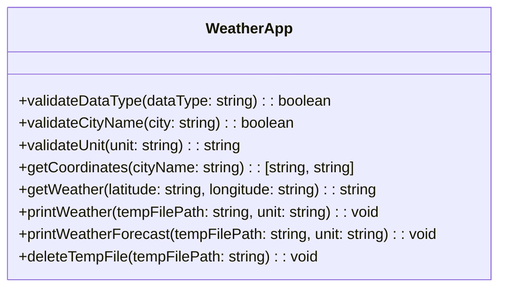

# WETTER-APP PROJEKT

**Gruppe:** Marco Amsler, Jim Stewart, Kirushanth Suthananthan, Dominik Meyer, Joshua Zbinden<br>
**Aufgabe:** In einer Gruppe eine lauffähige Python-Applikation entwickeln.<br>
**Ziel:** ```Bis spätestens am 7. Januar 2023 um 23:55 Uhr in der angemeldeten Gruppe eine voll funktionsfähige 
    Python-Anwendung entwickeln, eine Präsentation im PDF-Format über Moodle einreichen und dabei eine kurze 
    Projektvorstellung sowie einen Link zum GitHub-Repository inklusive der fertigen, lauffähigen Anwendung und einer 
    README-Datei bereitstellen.```<br>
**Repository:** https://github.com/amslerma/WeatherApp

---
## PROJEKT-BESCHREIBUNG
Eine Wetter-App, die Benutzern erlaubt, aktuelle Wetterinformationen abzurufen. 
Nutzer können Wetterdaten wie **Temperatur**, **Niederschlagswahrscheinlichkeit (Regen, Schauer, Schnee)**, 
**Windgeschwindigkeit** und **Wetterzustand (gemäss World Meteorological Organization (WMO))** für verschiedene Städte abrufen. Das Ziel ist es, präzise 
Wettervorhersagen zur Verfügung zu stellen, die für die tägliche Planung von Aktivitäten im Freien nützlich sind.

---
## Beschränkungen / out of Scope
- kein grafisches UI, sondern eine Konsolen basierte Ein-/Ausgabe

---
## USER-STORIES

### User-Story 1: Wetterabruf
**Als** Freizeitsportler  
**möchte ich** das aktuelle Wetter in meiner Stadt einsehen können  
**damit ich** entscheiden kann, ob ich draussen joggen gehen kann.

#### Akzeptanzkriterien:
- Ich kann meine Stadt eingeben und eine Anfrage stellen.
- Ich sehe die aktuellen Wetterbedingungen, einschliesslich Wetterzustand gem WMO, Luftfeuchtigkeit, Temperatur, Niederschlagsmenge und Windgeschwindigkeit 

### User-Story 2: Vorhersage
**Als** Reisende<br>
**möchte ich** eine 5-Tage-Wettervorhersage für beliebige Orte erhalten.  
**damit ich** meine Reisen entsprechend planen kann.

#### Akzeptanzkriterien:
- Ich kann den Namen einer Stadt eingeben und eine Wettervorhersage anfordern.
- Ich erhalte eine Wettervorhersage für die nächsten fünf Tage, einschliesslich Temperaturtrends und 
allgemeiner Wetterbedingungen.

### User-Story 3: Benutzerdefinierte Einstellungen
**Als** Benutzer  
**möchte ich** die Option haben, die Wettereinheiten "EU" (Celsius/Km/h/mm), "US" (Fahrenheit/Mph/Inch) zu wählen  
**damit ich** die Daten in einem für mich verständlichen Format sehen kann.

#### Akzeptanzkriterien:
- Ich kann meine bevorzugte Temperatureinheit auswählen.
- Die Wetterdaten werden in der von mir ausgewählten Einheit angezeigt.

---
## DATEN
- Datenquelle **Wetterdaten**: https://open-meteo.com/
- Datenquelle **Standorte**: ```worldcities.csv``` mit über 40'000 Städten und dazugehörigen Geo-Referenzpunkten

---
## FUNKTIONEN

### Übersicht "WeatherApp.py"
Funktion(Argumente)::Rückgabewert

---
## REFLEXION
Ziel der Projektarbeit war es, unsere Kenntnisse in der Programmiersprache ```Python``` zu vertiefen und sie in der Praxis 
anzuwenden.

Unser Team entschied sich für die Entwicklung einer einfachen **Wetter-Applikation**. Dabei wurde schnell klar, dass wir auf 
eine externe Schnittstelle zugreifen müssen, um Wetterdaten abzurufen. Wir haben die benötigten Funktionen sorgfältig 
ausgewählt, um sicherzustellen, dass sie realistische Anforderungen erfüllen.

Für die (zusammen) Arbeit und Kommunikation haben wir folgende Tools eingesetzt:
* **Individuelle IDE`S:** Programmierumgebung
* **GitHub:** Versionsverwaltung
* **Whatsapp und MS-Teams:** Informationsaustausch

Eine Herausforderung bestand darin, die Aufgaben innerhalb des Projekts aufzuteilen, insbesondere weil wir fünf 
Teammitglieder waren, die zuvor noch nicht zusammengearbeitet hatten. Trotzdem gelang es uns, die Arbeit effektiv zu 
koordinieren und jeder trug seinen Teil zum erfolgreichen Abschluss des Projekts bei.

Dieses Projekt war äusserst lehrreich und deckte viele der im Unterricht behandelten Themen ab. Besonders spannend war 
es, die Dokumentation öffentlicher Schnittstellen zu studieren und zu sehen, wie diese mit ```Python``` und anderen 
Datenquellen verknüpft werden können. 

Dieses Projekt hat unsere Fähigkeiten in der Python-Programmierung erweitert und uns wertvolle Einblicke in die Arbeit 
mit APIs und deren nutzung innerhalb einer Applikation verschafft.

---


